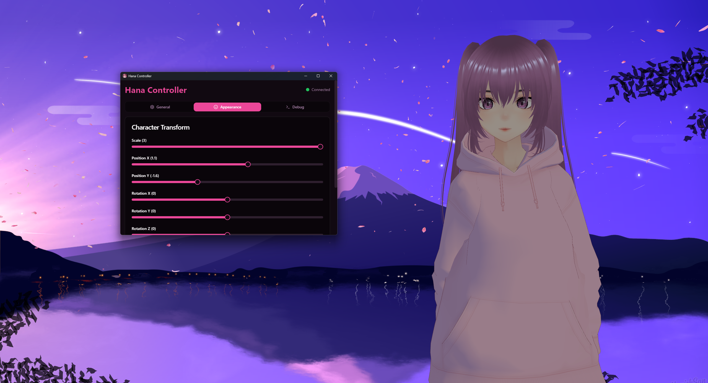

<div align="center">
  
  <h1>🌸 Hana Project</h1>
  
  <p>
    <b>A customizable, interactive 3D desktop companion that lives on your screen.</b>
  </p>
  
  
</div>

<br />

**Hana** is a fully customizable desktop companion. She lives on your desktop, watches your cursor, reacts to your presence, and can be customized with various animations and expressions. 

This project consists of two main parts:
1.  **Hana Companion**: The desktop application (Electron + Three.js) that renders the 3D character in a transparent, click-through window.
2.  **Hana Controller**: A modern web-based control panel (React + Vite) to adjust settings, debug animations, and manage behaviors in real-time.

---

## ✨ Features

### 🖥️ Desktop Companion
*   **Transparent Overlay**: The character renders directly on top of your desktop wallpaper and windows.
*   **Click-Through Mode**: Can be set to ignore mouse clicks so you can work "through" the character, or interactable mode to drag her around.
*   **VRM Support**: Compatible with `.vrm` standard models.
*   **Smart Tracking**:
    *   **Eye Tracking**: Eyes naturally follow your cursor.
    *   **Head Tracking**: Head rotates to face the cursor or points of interest.
    *   **Body Physics**: Neck and spine rotate realistically.
*   **Idle System**: Cycles through various idle animations (waiting, looking around, stretching) to feel alive.

### 🎮 Control Panel
*   **Real-time Configuration**: Adjust position, scale, and rotation instantly.
*   **Tracking Controls**: Toggle cursor tracking or switch to "Random Look" mode with configurable radius and timing.
*   **Animation Debugger**: Manually trigger specific animations (Wave, Think) or expressions (Happy, Angry) for testing.
*   **System Tray Integration**: Minimize the controller to the system tray for easy access.

---

## 🛠️ Prerequisites

Before you begin, ensure you have the following installed:
*   [Node.js](https://nodejs.org/) (Version 16+ recommended)
*   [npm](https://www.npmjs.com/) (included with Node.js)

---

## 🚀 Installation

1.  **Clone the Repository**
    ```bash
    git clone https://github.com/Matthew-IE/hana-project.git
    cd hana-project
    ```

2.  **Install Dependencies**
    We use a monolithic install script to set up both the Companion and Controller applications.
    ```bash
    npm run install:all
    ```
    *Alternatively, you can install them individually:*
    ```bash
    cd hana-companion && npm install
    cd ../hana-controller && npm install
    ```

---

## ▶️ Usage

To start the entire environment (Companion + Controller):

```bash
npm run dev
```

This command will:
1.  Launch the **Hana Companion** electron app (The character on your screen).
2.  Start the **Hana Controller** web server and open the interface.

### ⌨️ Controls & Shortcuts
*   **Drag Character**: Click and hold the character to move her around the screen (if Click-Through is OFF).
*   **F8**: Toggle `Click-Through` mode independently (Global Shortcut).
*   **System Tray**: Right-click the **Hana** icon in your system tray to open settings or exit.

---

## ⚙️ Configuration

The **Hana Controller** allows you to tweak behavior:

*   **General**:
    *   *Scale*: Resizes the character.
    *   *Position X/Y*: Fine-tune offset.
    *   *Rotation X/Y/Z*: Adjust orientation.
*   **Tracking**:
    *   *Look at Cursor*: Toggle getting stared at.
    *   *Sensitivity*: How aggressively she tracks your mouse.
    *   *Random Look*: When not tracking, she will randomly look at points of interest. You can set the **Interval** (how often) and **Radius** (how far).

---

## 📂 Project Structure

```
hana-project/
├── hana-companion/       # Electron Deskstop Application
│   ├── electron/         # Main process & Window management
│   ├── src/              # Renderer process (Three.js code)
│   └── public/           # Assets (Models, Icons)
│
├── hana-controller/      # Web Dashboard
│   ├── src/              # React UI Components
│   └── resources/        # Controller-specific assets
│
└── package.json          # Root scripts for monolithic management
```

## 🗺️ Roadmap

- [x] **Core Companion**: VRM rendering on transparent window.
- [x] **Smart Tracking**: Eye and head tracking with mouse interaction.
- [x] **Controller UI**: Web-based remote control for settings and debugging.
- [x] **Physics & Animations**: Bone-based rotation and idle animation system.
- [x] **AI Integration**: Local LLM connection via Ollama.
- [x] **Voice Communication**: Speech-to-Text via Whisper (Push-to-Talk).
- [ ] **Memory System**: Context-aware interactions based on past conversations.

---

## 🎙️ AI & Voice Setup (Phase 2)

To enable Voice and AI features, you must set up the local Python environment.

### 1. Prerequisites
- **Ollama**: Download and install from [ollama.com](https://ollama.com/).
- **Pull Model**: Run `ollama pull llama3` in your terminal.

### 2. Python Environment
The project uses a local virtual environment to handle AI processing.

```bash
# 1. Create Virtual Environment
python -m venv python/venv

# 2. Install Dependencies (Windows)
./python/venv/Scripts/pip install -r python/requirements.txt
```

### 3. Enable in Controller
1. Open **App** -> **Voice & AI** tab.
2. Enable **Voice (Whisper)**.
3. Enable **AI Responses**.
4. Hold the Microphone button, or use the PTT to talk!


## 🤝 Contributing

Contributions are welcome! Please feel free to submit a Pull Request.
